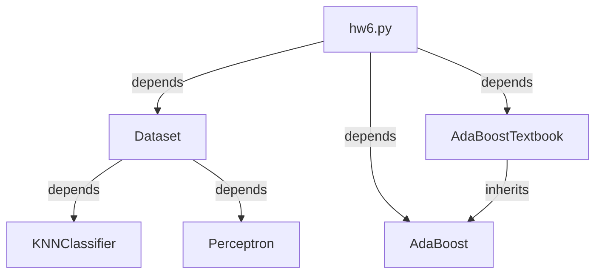

# Homework 6
> 106062202 陳騰鴻

## Program Structure

### Program files
* `hw6.py`
* `adaboost.py`
* `utils.py`

### Dependency


## AdaBoost
* Training:
	```python=
	def train(self, dataset):
        X_train, y_train = dataset.get_dataset()
        D = np.ones(y_train.shape) / y_train.size  # Distribution

        for t in range(self.T):
            X, y = dataset.get_subset(D)  # Get random subset according to D
            baseline = KNNClassifier(X, y, 3)
            alpha = self.update_D(X_train, y_train, baseline, D) # Update D

			# Record the baseline and alpha
            self.baselines.append(baseline)
            self.alphas.append(alpha)
	```
* Predict:
	```python=
	def predict(self, x):
		# Get prediction of all baselines
        h = self.baseline_predict(x)
        alpha = np.float32(self.alphas)
        return (alpha @ h > 0.0)
	```

## AdaBoostTextbook
* Training:
	```python=
	def train(self, dataset, eta, epochs):
        super().train(dataset)
        X_train, y_train = dataset.get_dataset()
        weight_learner = Perceptron(self.T, 0.2, 0.2)

        for epoch in range(epochs):
            for x, y in zip(X_train, y_train):
                h = super().baseline_predict(x)
                h = np.hstack([1, h])
                H = weight_learner.forward(h)
                weight_learner.update(h, y)

            h_list = []
            for x in X_train:
                h_list.append(super().baseline_predict(x))
            h = np.hstack([np.ones((y_train.size, 1)), np.vstack(h_list)])
            H = weight_learner.forward(h)
            if np.all(H == y_train):
                break
        else:
            print(f'Exceeded maximum {epochs} epochs. Training terminated.')
	```

## Program Execution and Results
### Command
`python3 hw6.py`

### Results
```
Original version accuracy: 0.9
Exceeded maximum 2 epochs. Training terminated.
Textbook version accuracy: 0.9
```
